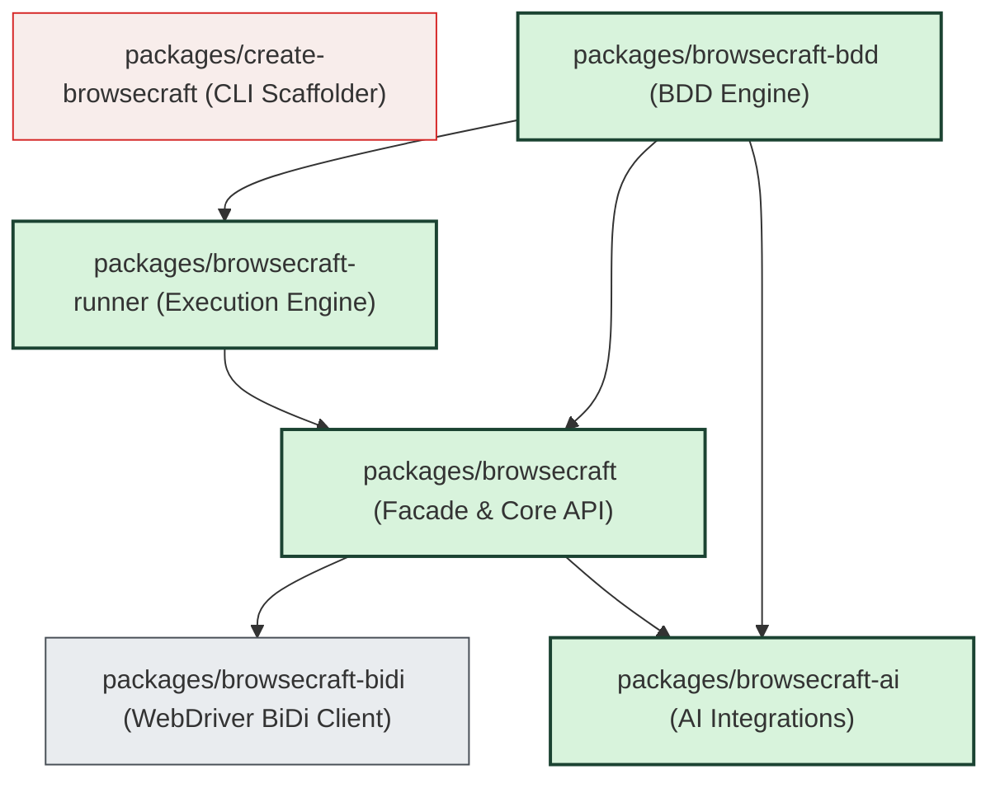

# Codebase Graph Map (Graphiphy) — Browsecraft

This document serves as a high-density, token-efficient architectural map of the **Browsecraft** codebase. It is designed to allow AI models and developers to understand the module graph, API boundaries, and execution flows without reading every source file, saving context tokens and speeding up coding tasks.

---

## 1. Monorepo Package Graph



---

## 2. Directory & Key Modules Map

### `packages/browsecraft-bidi` (WebDriver BiDi Protocol Client)
* **[launcher.ts](file:///C:/Users/achowdhury/browsecraft/packages/browsecraft-bidi/src/launcher.ts)** — Spawns headless/headed browser binaries (Chrome, Firefox, Edge) and establishes a websocket connection.
* **[session.ts](file:///C:/Users/achowdhury/browsecraft/packages/browsecraft-bidi/src/session.ts)** — Monopolizes WebSocket messaging; wraps command serialization and events.
* **[transport.ts](file:///C:/Users/achowdhury/browsecraft/packages/browsecraft-bidi/src/transport.ts)** — Low-level WebSocket client.
* **[types.ts](file:///C:/Users/achowdhury/browsecraft/packages/browsecraft-bidi/src/types.ts)** — Strict BiDi JSON-RPC schema types.

### `packages/browsecraft` (Facade, User API, Page Interaction)
* **[browser.ts](file:///C:/Users/achowdhury/browsecraft/packages/browsecraft/src/browser.ts)** — `Browser` and `BrowserContext` controller classes.
* **[page.ts](file:///C:/Users/achowdhury/browsecraft/packages/browsecraft/src/page.ts)** — Main class representing tab/page interaction APIs (`click()`, `fill()`, `see()`, etc.).
* **[locator.ts](file:///C:/Users/achowdhury/browsecraft/packages/browsecraft/src/locator.ts)** — Querying engines. Computes selector state and resolves actionability.
* **[expect.ts](file:///C:/Users/achowdhury/browsecraft/packages/browsecraft/src/expect.ts)** — Assertion framework (`expect(page)...`).
* **[wait.ts](file:///C:/Users/achowdhury/browsecraft/packages/browsecraft/src/wait.ts)** — Autowaiting mechanics and timing utilities.
* **[errors.ts](file:///C:/Users/achowdhury/browsecraft/packages/browsecraft/src/errors.ts)** — Custom exceptions (`ElementNotFoundError`, `classifyFailure()`).
* **[config.ts](file:///C:/Users/achowdhury/browsecraft/packages/browsecraft/src/config.ts)** — Merges default configurations with user-provided configurations.
* **[cli.ts](file:///C:/Users/achowdhury/browsecraft/packages/browsecraft/src/cli.ts)** — Test-running CLI router logic.

### `packages/browsecraft-runner` (Test Scheduling & Orchestration)
* **[worker-pool.ts](file:///C:/Users/achowdhury/browsecraft/packages/browsecraft-runner/src/worker-pool.ts)** — Handles spawning and recycling of multi-browser worker processes.
* **[scheduler.ts](file:///C:/Users/achowdhury/browsecraft/packages/browsecraft-runner/src/scheduler.ts)** — Work-stealing schedule loop; distributes scenarios across workers.
* **[event-bus.ts](file:///C:/Users/achowdhury/browsecraft/packages/browsecraft-runner/src/event-bus.ts)** — Decouples runner from reporter. Emits life-cycle events.
* **[result-aggregator.ts](file:///C:/Users/achowdhury/browsecraft/packages/browsecraft-runner/src/result-aggregator.ts)** — Cross-browser matrices, stats, and analytics.

### `packages/browsecraft-bdd` (Behavior-Driven Development Framework)
* **[gherkin-parser.ts](file:///C:/Users/achowdhury/browsecraft/packages/browsecraft-bdd/src/gherkin-parser.ts)** — Lexes Gherkin scripts into structural trees.
* **[step-registry.ts](file:///C:/Users/achowdhury/browsecraft/packages/browsecraft-bdd/src/step-registry.ts)** — Compiles step patterns (`Given`, `When`, `Then`) and maps them to functions.
* **[executor.ts](file:///C:/Users/achowdhury/browsecraft/packages/browsecraft-bdd/src/executor.ts)** — Drives Gherkin document parsing, execution, and hook firing.
* **[ts-bdd.ts](file:///C:/Users/achowdhury/browsecraft/packages/browsecraft-bdd/src/ts-bdd.ts)** — TypeScript-native BDD interface (`feature()`, `scenario()`).
* **[ai-step-executor.ts](file:///C:/Users/achowdhury/browsecraft/packages/browsecraft-bdd/src/ai-step-executor.ts)** — LLM generator that interprets and executes undefined steps on the fly.
* **[ai-steps.ts](file:///C:/Users/achowdhury/browsecraft/packages/browsecraft-bdd/src/ai-steps.ts)** — Caching/locking engine for generated step definitions.

### `packages/browsecraft-ai` (AI Utilities)
* **[github-models.ts](file:///C:/Users/achowdhury/browsecraft/packages/browsecraft-ai/src/github-models.ts)** — Free access integration point to GitHub Models.
* **[providers.ts](file:///C:/Users/achowdhury/browsecraft/packages/browsecraft-ai/src/providers.ts)** — Unifies OpenAI, Anthropic, and Ollama APIs.
* **[self-healing.ts](file:///C:/Users/achowdhury/browsecraft/packages/browsecraft-ai/src/self-healing.ts)** — Intercepts failure, repairs selectors, and updates cache.
* **[visual-diff.ts](file:///C:/Users/achowdhury/browsecraft/packages/browsecraft-ai/src/visual-diff.ts)** — Pixel/Semantic image comparisons.

---

## 3. Core API Specifications (Quick Lookup)

### `Browser` & `BrowserContext` (browsecraft)
```typescript
class Browser {
  static launch(options?: {
    browser?: 'chrome' | 'firefox' | 'edge';
    headless?: boolean;
    maximized?: boolean;
    args?: string[];
  }): Promise<Browser>;
  
  newPage(): Promise<Page>;
  close(): Promise<void>;
  get isConnected(): boolean;
  get openPages(): Page[];
}

class BrowserContext {
  newPage(): Promise<Page>;
  close(): Promise<void>;
  cookies(): Promise<StorageCookie[]>;
  clearCookies(): Promise<void>;
}
```

### `Page` (browsecraft)
```typescript
class Page {
  go(url: string, options?: GotoOptions): Promise<void>;
  click(target: string | ClickOptions): Promise<void>;
  fill(target: string | FillOptions, value: string): Promise<void>;
  see(textOrTarget: string | LocatorOptions): Promise<void>;
  
  url(): Promise<string>;
  title(): Promise<string>;
  content(): Promise<string>;
  screenshot(): Promise<Buffer>;
  
  waitForURL(url: string | RegExp, options?: WaitOptions): Promise<void>;
  waitForSelector(options: LocatorOptions): Promise<void>;
  waitForResponse(urlPattern: string | RegExp, options?: WaitOptions): Promise<any>;
  
  mock(route: string, response: MockResponse): Promise<void>;
  intercept(route: string, handler: (req: InterceptedRequest) => Promise<MockResponse>): Promise<void>;
  blockRequests(patterns: string[]): Promise<void>;
  evaluate<T>(expression: string): Promise<T>;
}
```

### `Locator` (browsecraft)
```typescript
type ElementTarget = string | { selector: string } | { role: string; name: string };

class ElementHandle {
  textContent(): Promise<string | null>;
  innerText(): Promise<string>;
  isVisible(): Promise<boolean>;
  isEnabled(): Promise<boolean>;
  getAttribute(name: string): Promise<string | null>;
  click(): Promise<void>;
  fill(value: string): Promise<void>;
}
```

### `BddExecutor` (browsecraft-bdd)
```typescript
class BddExecutor {
  constructor(options: ExecutorOptions);
  runDocument(doc: GherkinDocument): Promise<RunResult>;
}

interface ExecutorOptions {
  registry: StepRegistry;
  worldFactory: () => Promise<StepWorld>;
  grep?: string;
  scenarioFilter?: (name: string, tags: string[], uri: string) => boolean;
  tagFilter?: string;
  aiSteps?: 'off' | 'auto' | 'locked' | 'warm';
}
```

---

## 4. Crucial Execution Workflows

### 4.1 Action Execution Flow (Page ➔ Locator ➔ WebDriver BiDi)
```
[User Code] page.click("Login")
   └── [page.ts] Resolves text target using locator rules
         └── [locator.ts] Resolves to DOM element + checks actionability
               ├── 1. Visibility (opacity, display, visibility)
               ├── 2. Enabled state (button not disabled)
               ├── 3. Obscurity (pointer-events checks)
               └── 4. Self-Healing Selector (if selector fails & AI config enabled)
                     └── [self-healing.ts] AI retrieves context, finds new selector, heals & caches
         └── [session.ts] Serializes action into JSON-RPC command
               └── [transport.ts] Sends "script.callFunction" websocket payload
                     └── [Real Browser] Clicks element
```

### 4.2 Run Workflow (Scheduler ➔ WorkerPool ➔ EventBus)
```
[CLI / Runner] scheduler.run(scenarios)
   └── [scheduler.ts] Enqueues scenarios to a shared work queue
         └── [worker-pool.ts] Spawns X worker browser processes (Chrome/Firefox/Edge)
               └── [worker] Worker pulls scenario ➔ executes scenario ➔ fires event
                     └── [event-bus.ts] Emits 'item:start' / 'item:pass' / 'item:fail'
   └── [result-aggregator.ts] Listens to bus, aggregates statistics, builds result matrix
```

---

## 5. Coding Principles for LLMs (Save Context & Tokens)

1. **Do not read node_modules**: Packages inside `node_modules` are compiled. Refer to the specifications in this file instead.
2. **Compile before running tests**: The test suites run against `packages/*/dist/` output. You must run `pnpm build` before running tests, or else you will run stale code.
3. **No string concatenation**: Always write template literals (` `Name: ${name}` `) to satisfy Biome rules.
4. **Use exact types**: Never use `any`. Use custom types from [errors.ts](file:///C:/Users/achowdhury/browsecraft/packages/browsecraft/src/errors.ts) or [types.ts](file:///C:/Users/achowdhury/browsecraft/packages/browsecraft-bidi/src/types.ts).
5. **Junction structure**: The workspace utilizes a Windows directory junction under the scratch path. Modifying files under `C:\Users\achowdhury\.gemini\antigravity\scratch\browsecraft` modifies the source files in `C:\Users\achowdhury\browsecraft` immediately.

---

## 6. Local Validation Command

Before submitting any code changes, run the full verification pipeline to ensure no regressions occur:

```bash
pnpm build && pnpm lint && node tests/unit/run-all.mjs && node tests/smoke.mjs
```
